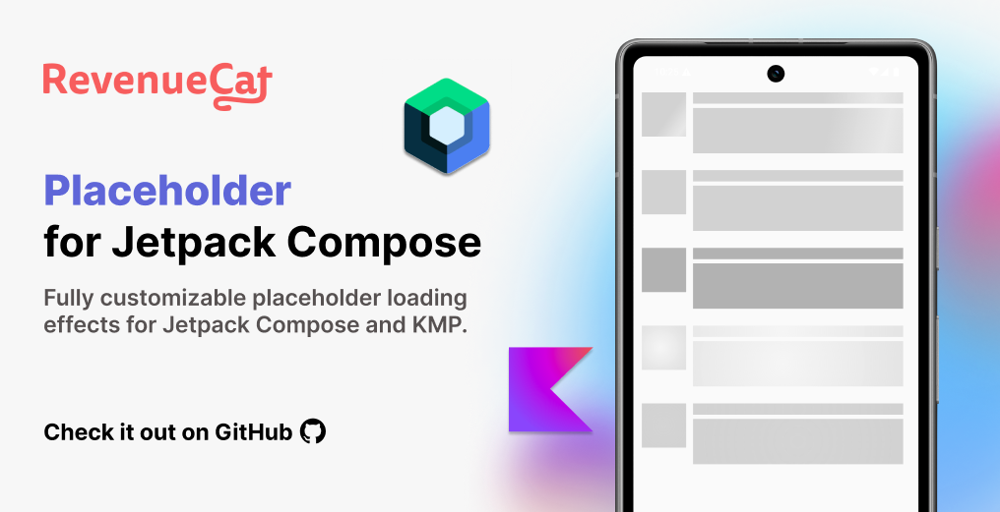

<a href="https://www.revenuecat.com/docs/getting-started/quickstart?utm_medium=organic&utm_source=github&utm_campaign=advocate"></a><br><br>

<p align="center">
  <a href="https://opensource.org/licenses/Apache-2.0"></a>
  <a href="https://android-arsenal.com/api?level=24"></a>
  <a href="https://github.com/revenuecat/placeholder-compose/actions/workflows/android.yml"></a>
  <a href="https://revenuecat.github.io/placeholder-compose/"></a>
</p>

<p align="center">
✨ Fully customizable placeholder loading effects for Jetpack Compose and KMP.
</p><br>

## 📷 Previews

<p align="center">


</p>

## ✍️ Technical Content

If you want to explore how to create custom modifiers with the primary three different APIs, `Modifier.then()`, `Modifier.composed()`, and `Modifier.Node`, and demonstrate how RevenueCat’s Android SDK leverages `Modifier.Node` to deliver better UI performance, check out [Exploring Modifier.Node for creating custom Modifiers in Jetpack Compose](https://www.revenuecat.com/blog/engineering/compose-custom-modifier/).

<a href="https://www.revenuecat.com/docs/getting-started/quickstart?utm_medium=organic&utm_source=github&utm_campaign=advocate">

</a>

## Contribution 🧡
Placeholder is maintained by [RevenueCat](https://www.revenuecat.com?utm_medium=organic&utm_source=github&utm_campaign=advocate). [RevenueCat SDK for Android](https://www.revenuecat.com/docs/getting-started/installation/android?utm_medium=organic&utm_source=github&utm_campaign=advocate) allows you to implement in-app subscriptions and a paywall system on top of Google Play Billing. Also, anyone can contribute to improving code, docs, or something following our [Contributing Guideline](https://github.com/RevenueCat/placeholder-compose/blob/main/CONTRIBUTING.md).

## Download
[](https://search.maven.org/search?q=g:%22com.revenuecat%22%20AND%20a:%22placeholder%22)

### Version Catalog

If you're using Version Catalog, you can configure the dependency by adding it to your `libs.versions.toml` file as follows:

```toml
[versions]
#...
placeholder = "1.0.1"

[libraries]
#...
compose-placeholder = { module = "com.revenuecat.purchases:placeholder", version.ref = "placeholder" }
```

### Gradle

Add the dependency below to your **module**'s `build.gradle.kts` file:

```gradle
dependencies {
    implementation("com.revenuecat.purchases:placeholder:$version")

    // if you're using Version Catalog
    implementation(libs.compose.placeholder)
}
```

For Kotlin Multiplatform, add the dependency below to your **module**'s `build.gradle.kts` file:

```gradle
sourceSets {
    val commonMain by getting {
        dependencies {
            implementation(libs.compose.placeholder)
        }
    }
}
```

## Usage

You can easily implement beautiful loading placeholders using the `placeholder` modifier. It offers intuitive customization options for colors, shapes, and highlight animations, allowing you to create a wide variety of loading effects. If you want to just directly dive into the sample codes, check out the [demo project](https://github.com/RevenueCat/placeholder-compose/tree/main/app).

### Basic Usage

The `placeholder` modifier displays an animated loading overlay over your content while it's being loaded. Simply add it to any composable and control its visibility with a boolean state.

```kotlin
var isLoading by remember { mutableStateOf(true) }

Text(
    text = "User Name",
    modifier = Modifier.placeholder(enabled = isLoading)
)
```

When `enabled` is `true`, the placeholder overlay appears with a smooth animation. When it becomes `false`, the actual content is revealed with an elegant fade-in transition.

### Customizing Colors

You can customize the placeholder background color to match your app's theme. The color parameter accepts any Compose `Color` value.

```kotlin
var isLoading by remember { mutableStateOf(true) }

Text(
    text = "User Name",
    modifier = Modifier
        .fillMaxWidth()
        .padding(16.dp)
        .placeholder(
            enabled = isLoading,
            color = Color.LightGray.copy(alpha = 0.5f)
        )
)
```

### Customizing Shapes

The placeholder can take any shape you want. By default, it uses a rectangle, but you can easily change it to match your UI elements.

```kotlin
var isLoading by remember { mutableStateOf(true) }

Image(
    painter = painterResource(id = R.drawable.profile),
    contentDescription = "Profile picture",
    modifier = Modifier
        .size(80.dp)
        .placeholder(
            enabled = isLoading,
            color = Color.Gray,
            shape = CircleShape  // Perfect for circular avatars
        )
)
```

You can use any shape from Material or create custom shapes:

```kotlin
Box(
    modifier = Modifier
        .size(200.dp, 100.dp)
        .placeholder(
            enabled = isLoading,
            shape = RoundedCornerShape(16.dp)
        )
)
```

### Using Different Highlight Effects

The library provides several pre-built highlight animations in `PlaceholderDefaults`. Each effect creates a different visual indication that content is loading.

#### Shimmer Effect

The shimmer effect sweeps a bright gradient across the placeholder, creating a popular "shimmering" loading indicator.

```kotlin
var isLoading by remember { mutableStateOf(true) }

Card(
    modifier = Modifier
        .fillMaxWidth()
        .height(100.dp)
        .placeholder(
            enabled = isLoading,
            highlight = PlaceholderDefaults.shimmer
        )
) {
    // Your content here
}
```

#### Fade Effect

The fade effect creates a subtle breathing animation by fading the highlight in and out.

```kotlin
Text(
    text = "Loading...",
    modifier = Modifier.placeholder(
        enabled = isLoading,
        highlight = PlaceholderDefaults.fade
    )
)
```

#### Pulse Effect

The pulse effect rhythmically brightens and dims the highlight, creating a pulsating effect.

```kotlin
Box(
    modifier = Modifier
        .fillMaxWidth()
        .height(200.dp)
        .placeholder(
            enabled = isLoading,
            highlight = PlaceholderDefaults.pulse
        )
)
```

#### Circular Reveal

The circular reveal creates a ripple effect that expands from the center of the placeholder.

```kotlin
Image(
    painter = placeholderPainter,
    contentDescription = null,
    modifier = Modifier
        .size(150.dp)
        .placeholder(
            enabled = isLoading,
            highlight = PlaceholderDefaults.circularReveal,
            shape = CircleShape
        )
)
```

#### Light Reveal

The light reveal effect simulates a liquid, flowing wave of light moving across the placeholder.

```kotlin
Card(
    modifier = Modifier
        .fillMaxWidth()
        .height(100.dp)
        .placeholder(
            enabled = isLoading,
            highlight = PlaceholderDefaults.lightReveal
        )
)
```

### Disabling Highlight Animation

If you prefer a static placeholder without any animation, simply set `highlight` to `null`.

```kotlin
Box(
    modifier = Modifier
        .fillMaxWidth()
        .height(100.dp)
        .placeholder(
            enabled = isLoading,
            highlight = null  // No animation
        )
)
```

### Creating Custom Highlight Effects

For complete control over the highlight animation, you can create your own implementation by extending the `PlaceholderHighlight` interface.

#### Custom Shimmer with Different Parameters

You can customize the built-in shimmer effect by creating your own `Shimmer` instance with custom parameters.

```kotlin
val customShimmer = Shimmer(
    highlightColor = Color.Blue.copy(alpha = 0.6f),
    animationSpec = infiniteRepeatable(
        animation = tween(durationMillis = 1000, easing = LinearEasing),
        repeatMode = RepeatMode.Restart
    ),
    intensity = 0.2f,    // Controls brightness
    dropOff = 0.7f,      // Controls edge fading
    tilt = 30f           // Angle of the shimmer
)

Box(
    modifier = Modifier
        .fillMaxWidth()
        .height(100.dp)
        .placeholder(
            enabled = isLoading,
            highlight = customShimmer
        )
)
```

#### Custom Fade with Different Timing

Similarly, you can customize other effects by providing different parameters.

```kotlin
val customFade = Fade(
    highlightColor = Color.White.copy(alpha = 0.8f),
    animationSpec = infiniteRepeatable(
        animation = tween(durationMillis = 1000),
        repeatMode = RepeatMode.Reverse
    )
)

Text(
    text = "Custom fade effect",
    modifier = Modifier.placeholder(
        enabled = isLoading,
        highlight = customFade
    )
)
```

#### Fully Custom Highlight

For complete customization, implement the `PlaceholderHighlight` interface. This gives you full control over the brush and alpha values at each point in the animation.

```kotlin
@Stable
private class RainbowShimmer : PlaceholderHighlight {
    override val animationSpec = infiniteRepeatable(
        animation = tween(durationMillis = 2000, easing = LinearEasing),
        repeatMode = RepeatMode.Restart
    )

    override fun brush(progress: Float, size: Size): Brush {
        val colors = listOf(
            Color.Red, Color.Yellow, Color.Green,
            Color.Cyan, Color.Blue, Color.Magenta, Color.Red
        )
        val startX = -size.width + (size.width * 2 * progress)
        return Brush.horizontalGradient(
            colors = colors,
            startX = startX,
            endX = startX + size.width
        )
    }

    override fun alpha(progress: Float): Float = 1.0f
}

// Usage
Box(
    modifier = Modifier
        .fillMaxWidth()
        .height(100.dp)
        .placeholder(
            enabled = isLoading,
            highlight = RainbowShimmer()
        )
)
```

### Customizing Transition Animations

You can customize how the placeholder and content fade in and out by providing custom animation specs.

```kotlin
Box(
    modifier = Modifier
        .fillMaxWidth()
        .height(100.dp)
        .placeholder(
            enabled = isLoading,
            placeholderFadeTransitionSpec = {
                tween(durationMillis = 500)
            },
            contentFadeTransitionSpec = {
                tween(durationMillis = 800, easing = FastOutSlowInEasing)
            }
        )
)
```

The `placeholderFadeTransitionSpec` controls how the placeholder fades in and out, while `contentFadeTransitionSpec` controls how the actual content appears.

### Common Use Cases

#### Loading a List of Items

A common pattern is to show placeholder items while loading a list.

```kotlin
@Composable
fun UserList(users: List<User>?, isLoading: Boolean) {
    LazyColumn {
        items(if (isLoading) 5 else users?.size ?: 0) { index ->
            UserListItem(
                user = users?.getOrNull(index),
                isLoading = isLoading
            )
        }
    }
}

@Composable
fun UserListItem(user: User?, isLoading: Boolean) {
    Row(
        modifier = Modifier
            .fillMaxWidth()
            .padding(16.dp),
        verticalAlignment = Alignment.CenterVertically
    ) {
        // Avatar
        Box(
            modifier = Modifier
                .size(48.dp)
                .placeholder(
                    enabled = isLoading,
                    shape = CircleShape,
                    highlight = PlaceholderDefaults.shimmer
                )
        )

        Spacer(modifier = Modifier.width(16.dp))

        Column {
            // Name
            Text(
                text = user?.name ?: "Loading name",
                modifier = Modifier
                    .fillMaxWidth(0.6f)
                    .placeholder(
                        enabled = isLoading,
                        shape = RoundedCornerShape(4.dp)
                    )
            )

            Spacer(modifier = Modifier.height(4.dp))

            // Email
            Text(
                text = user?.email ?: "Loading email",
                modifier = Modifier
                    .fillMaxWidth(0.8f)
                    .placeholder(
                        enabled = isLoading,
                        shape = RoundedCornerShape(4.dp)
                    )
            )
        }
    }
}
```

#### Loading an Image with AsyncImage

Perfect for showing a placeholder while images load from the network.

```kotlin
var isLoading by remember { mutableStateOf(true) }

AsyncImage(
    model = imageUrl,
    contentDescription = "Product image",
    onSuccess = { isLoading = false },
    modifier = Modifier
        .fillMaxWidth()
        .height(200.dp)
        .placeholder(
            enabled = isLoading,
            highlight = PlaceholderDefaults.shimmer
        )
)
```

#### Card with Multiple Placeholder Elements

```kotlin
@Composable
fun ProductCard(product: Product?, isLoading: Boolean) {
    Card(
        modifier = Modifier
            .fillMaxWidth()
            .padding(16.dp)
    ) {
        Column(
            modifier = Modifier.padding(16.dp)
        ) {
            // Product image
            Box(
                modifier = Modifier
                    .fillMaxWidth()
                    .height(200.dp)
                    .placeholder(
                        enabled = isLoading,
                        shape = RoundedCornerShape(8.dp),
                        highlight = PlaceholderDefaults.shimmer
                    )
            )

            Spacer(modifier = Modifier.height(16.dp))

            // Product title
            Text(
                text = product?.title ?: "Loading title",
                style = MaterialTheme.typography.titleLarge,
                modifier = Modifier
                    .fillMaxWidth(0.7f)
                    .placeholder(
                        enabled = isLoading,
                        shape = RoundedCornerShape(4.dp)
                    )
            )

            Spacer(modifier = Modifier.height(8.dp))

            // Product description
            Text(
                text = product?.description ?: "Loading description",
                style = MaterialTheme.typography.bodyMedium,
                modifier = Modifier
                    .fillMaxWidth()
                    .placeholder(
                        enabled = isLoading,
                        shape = RoundedCornerShape(4.dp)
                    )
            )

            Spacer(modifier = Modifier.height(16.dp))

            // Price
            Text(
                text = product?.price ?: "$0.00",
                style = MaterialTheme.typography.headlineSmall,
                modifier = Modifier
                    .width(80.dp)
                    .placeholder(
                        enabled = isLoading,
                        shape = RoundedCornerShape(4.dp),
                        highlight = PlaceholderDefaults.pulse
                    )
            )
        }
    }
}
```

## Find this repository useful? 😻

Support it by joining __[stargazers](https://github.com/revenuecat/placeholder-compose/stargazers)__ for this repository. :star: <br>
Also, __[follow the main contributor](https://github.com/skydoves)__ on GitHub for the next creations! 🤩

# License
```xml
Copyright (c) 2025 RevenueCat, Inc.

Licensed under the Apache License, Version 2.0 (the "License");
you may not use this file except in compliance with the License.
You may obtain a copy of the License at

   http://www.apache.org/licenses/LICENSE-2.0

Unless required by applicable law or agreed to in writing, software
distributed under the License is distributed on an "AS IS" BASIS,
WITHOUT WARRANTIES OR CONDITIONS OF ANY KIND, either express or implied.
See the License for the specific language governing permissions and
limitations under the License.
```
